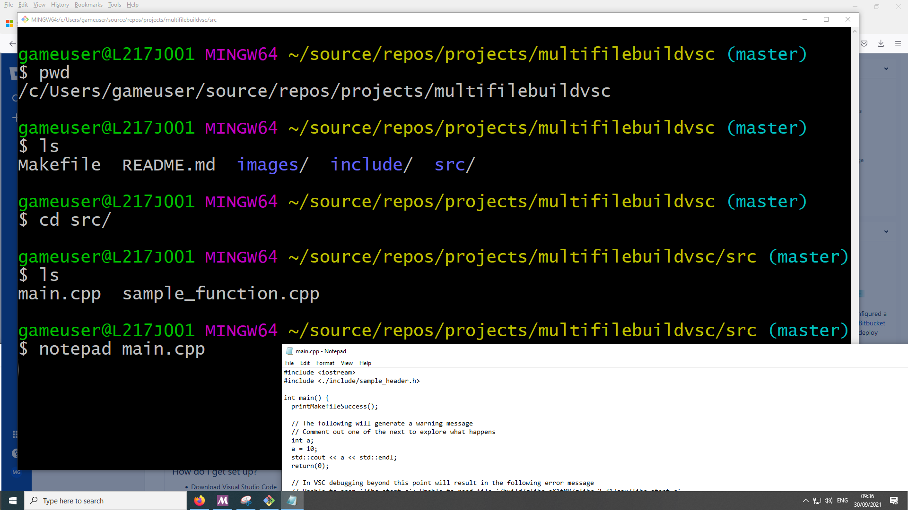

# README #

This project is a **Visual Studio Code** with and SDL2 starter kit

## What is this repository for? ##
* Getting started with Visual Studio Code, Makefiles and SDL2

### How do I get set up? ###
* Download Visual Studio Code
* Install C/C++ for Visual Studio Code
> `ctrl+shift+x`
search for `@ext:ms-vscode.cpptools` or `C/C++ IntelliSense, debugging, and code browsing.`
Install this plugin,
* Ensure build tools are installed one linux run terminal command `sudo apt install build-essential gdb`. This installs essential build tools and gdb debugger. For Windows see [Using GCC with MinGW](https://code.visualstudio.com/docs/cpp/config-mingw).
* Create Makefiles and Source

## Configuration guidelines ##
* Ensure Visual Studio Code is setup correcly. A typical error is that 'Tab's is set to spaces instead of being stored as tabs.
* Makefile should be indented using tabs, if you receive an error message similar to this `Makefile:2: *** missing separator. Stop.` check your VSC tabs settings
* Stackoverflow has entry on this specific error message [Stackoverflow](https://stackoverflow.com/questions/23927212/makefile2-missing-separator-stop).
*  [Makefile execution success](./images/MakeFileSuccess.png)\

## Setting Up Build Tools with Msys64 on Windows ##

### Get familiar with ***Bash*** commands
* If you already have GitBash installed tryout the following terminal commands
* `pwd' Present working directory
* `ls` list the contents of a directory
* `cd` change directory
* `mkdir` make directory\
\

### Download Msys
* Download Msys from [https://www.msys2.org/](https://www.msys2.org/)
> ***NOTE*** Msys is a helpful installer that uses a package manager called `pacman'. [Pacman](https://www.msys2.org/docs/package-management/) is used in ***Arch Linux*** for package management.

* Run the Msys terminal and Update pacman
* Update the package database and base packages type `pacman -Syu`
* Run "MSYS2 MSYS" and update the rest of the base packages with `pacman -Su`
* Install ***git***, open "MSYS2 MSYS" terminal and type `pacman -S git`  
\
* Install ***make***, open "MSYS2 MSYS" terminal and type`pacman -S make`  
\
* Open "MSYS2 MSYS" terminal and type `pacman -S mingw-w64-x86_64-gcc` to install gcc / g++ . This can take sometime to complete.
* To install GDB Open "MSYS2 MSYS" terminal and type `pacman -S mingw-w64-x86_64-gdb`. This can take sometime to complete.
* Open "MSYS 64" and type `g++` to check g++ is installed. Type `gdb` to check that gdb is installed.
* Modify system path to include path to mingw64 `C:\msys64\mingw64\bin`\
\
* Open up a command prompt and type `g++ --version` to check g++ is installed. Type `gdb --version` to check that gdb is installed.

> ***Note*** modify Terminal Settings in VSC to enable MSYS Bash Terminal
```
{
     "terminal.integrated.shell.windows": "C:\\msys64\\usr\\bin\\bash.exe", 
     "terminal.integrated.shellArgs.windows": ["--login", "-i"],
     "terminal.integrated.env.windows": { 
          "MSYSTEM": "MINGW64", 
          "CHERE_INVOKING":"1" } 
}
```

## Useful Resources ##
* [GNU Make Manual](http://www.gnu.org/software/make/manual/make.html)
* [Makefile Tutorial](https://makefiletutorial.com/)
* [GDB GNU Debugger Project](https://www.gnu.org/software/gdb/)
* [Enabling build and debugging in Visual Studio Code](https://dev.to/talhabalaj/setup-visual-studio-code-for-multi-file-c-projects-1jpi)
* Debugging with VSC beyond return point may result in the following error message being displayed [pop up](https://github.com/Microsoft/vscode-cpptools/issues/1123)
* SDL Makefile [sdl-config](https://wiki.libsdl.org/FAQLinux)

## Who do I talk to? ##
* philip.bourke@itcarlow.ie